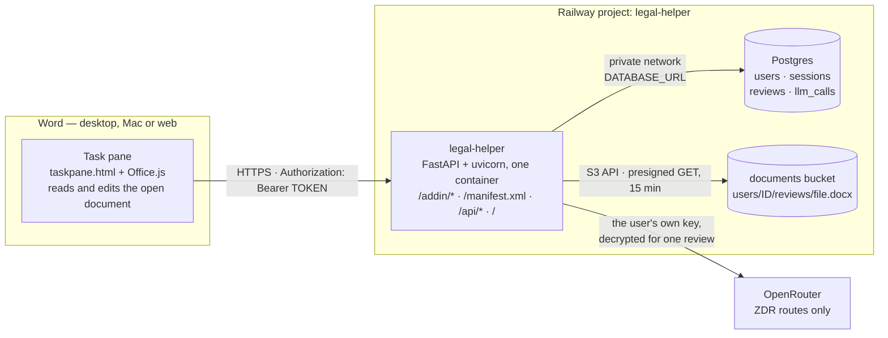
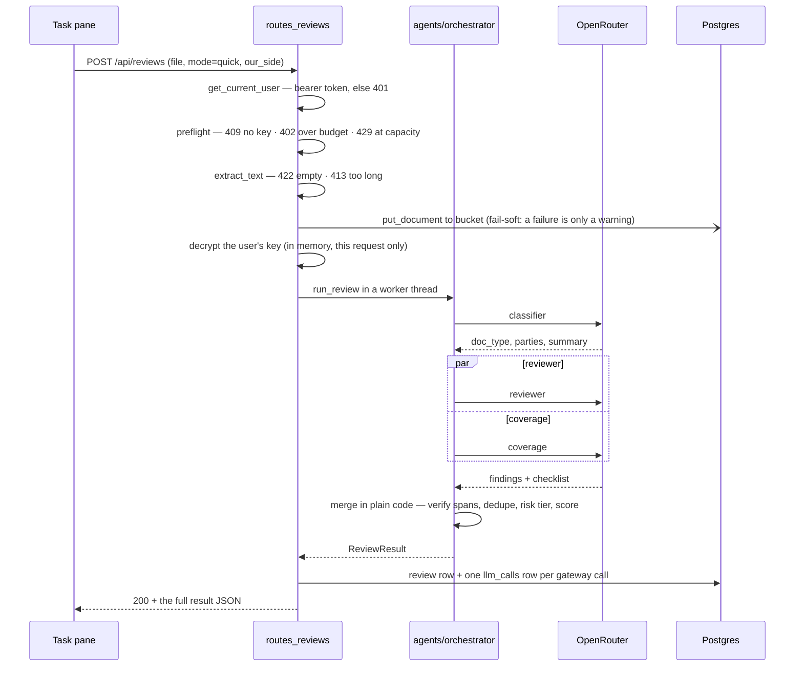

# Legal Helper

A Microsoft Word task-pane add-in plus a small FastAPI service that reviews the open `.docx`
against an editable legal playbook using a team of LLM agents over OpenRouter — **Zero-Data-Retention
routes only** — and returns findings the add-in applies as tracked changes and comments.

Built as a teaching demo for the "Deployment 2" workshop. It deploys as **one project, three
Railway services**: the app (FastAPI in one container), Postgres, and a storage bucket.

## Deploy your own

[](https://railway.com/new/template/14kjhi?utm_medium=integration&utm_source=button&utm_campaign=legal-helper)

One click provisions all three services — the app from this repo, Postgres, and the `documents`
bucket — and wires `DATABASE_URL` and the five `S3_*` variables between them for you. Railway asks
you for three values:

| Variable | What to put |
|---|---|
| `APP_ENV` | `prod` |
| `APP_SECRET_KEY` | Any long random string. It encrypts the OpenRouter keys your users save — pick one and keep it, because changing it later makes stored keys unreadable. |
| `ADDIN_ID` | Any GUID, e.g. from `uuidgen`. It identifies the add-in to Word; one per deployment. |

Then pick a bucket region and hit **Deploy**. When it goes green: open your new domain, download
`/manifest.xml`, sideload it in Word, and create your account from the task pane. No account,
password, or key ships with this repo — the first person to register is the first user.

There is no `OPENROUTER_API_KEY` to set. Each user brings their own key (see below).

---

## Quick start (local)

```bash
make install                  # create backend/.venv and install pinned deps
make run                      # uvicorn on :8000, autoreload
```

```bash
curl -s localhost:8000/healthz     # -> {"status":"ok"}
curl -s localhost:8000/api/status  # version, capabilities, totals
open http://localhost:8000/        # landing page + manifest download
```

**Accounts are self-service — none are seeded.** A fresh deployment has an empty users table.
Tap **Create one** on the add-in's sign-in screen and register with a username, a password and your
own OpenRouter key; the server validates that key against OpenRouter before creating the account,
so nobody ends up with an account that cannot actually run a review.

No account ships with the code, so there is no password in this repo to leak and nothing to rotate
after a workshop. Set `SIGNUP_ENABLED=false` to close registration once everyone has signed up.

Optional, once you have an account — give it demo history, or the admin role:

```bash
make seed USER_ACCOUNT=jane.tan                          # ~140 synthetic reviews
cd backend && .venv/bin/python -m app.seed_demo --promote jane.tan   # grant admin
```

The app boots with **zero environment variables** — SQLite locally, bucket capability simply
reports `disabled`. Reviews additionally need a per-user OpenRouter key (see below).

Add-in dev server (Node 18+):

```bash
cd word-addin && npm install && node dev-server.mjs   # https://localhost:3000, proxies /api
```

Then sideload `word-addin/manifest.dev.xml`. See [`word-addin/README.md`](word-addin/README.md)
for sideloading on Mac, Windows, and the web.

---

## Where the OpenRouter key lives

**It is not an environment variable.** There is deliberately no `OPENROUTER_API_KEY` setting.

Each user pastes their own key into the add-in once. The server validates it against
`GET https://openrouter.ai/api/v1/key`, encrypts it with Fernet (`APP_SECRET_KEY`) and stores the
ciphertext on the user's row (`users.openrouter_key_enc`). It is decrypted in memory for the
duration of one review and never returned by any endpoint — the API exposes only the last 4
characters and the key's label. That is what makes per-user spend metering trustworthy.

The one secret that *is* an env var is `APP_SECRET_KEY`, the Fernet key those user keys are
encrypted with. Rotating it invalidates every stored key.

---

## Architecture

### Deployment topology



### Code architecture

The backend is four layers plus cross-cutting concerns. Dependencies point downward only —
**nothing in `agents/`, `ai/`, or `engine/` imports FastAPI**, so the whole review pipeline runs
(and is tested) without an HTTP server.

```
HTTP edge      main.py                  create_app(): settings → logging → capabilities → routers → /healthz → default-deny 404
               api/routes_auth.py       POST /api/auth/login · logout          (per-IP throttle, argon2, dummy_verify)
               api/routes_me.py         GET /api/me · the user's OpenRouter key · model preferences · ZDR model list
               api/routes_reviews.py    POST /api/reviews (quick sync / deep async) · get · list · delete · document
               api/routes_usage.py      GET /api/me/usage · GET /api/admin/usage
               api/routes_pages.py      GET / (landing) · GET /api/status
               api/routes_addin.py      /addin/* static bundle · GET /manifest.xml (rewritten for the request origin)
               api/errors.py            the single {"error": {...}} envelope
               auth/deps.py             get_current_user (bearer) · require_admin — deny by default
        │
        ▼
Domain         agents/orchestrator.py   run_review(): classifier → reviewer ‖ coverage → deterministic merge
               agents/classifier.py     doc_type, parties, governing law, one-line summary
               agents/reviewer.py       findings; "triage" style for quick, "edit" style (drafts language) for deep
               agents/coverage.py       closed checklist of the playbook's required positions (deep only)
               agents/base.py           an Agent = name + prompt + JSON schema + effort + max_tokens
               agents/schemas.py        the response_format schemas, asserted portable at import
               engine/spans.py          verbatim-substring gate → span_faithful (the safety check before any edit)
               playbook/loader.py       load + validate legal_helper_playbook.json, render the prompt block
               ingestion/docx.py        .docx → text (python-docx only)
        │
        ▼
Model access   ai/gateway.py            retry ladder, circuit breaker, fence_document
               ai/openrouter.py         the ZDR-pinned adapter; takes the API key PER CALL, not from settings
               ai/ledger.py             contextvar ledger: one LlmCall record per gateway call
               ai/zdr.py                fetch + 10-min cache of /api/v1/endpoints/zdr; validates model choices
        │
        ▼
Persistence    models.py                users · sessions · reviews · llm_calls (SQLAlchemy)
               api/reviews_repo.py      create/complete/fail a review, list for a user, usage aggregates, stale-job sweep
               db.py · db_migrate.py    engine/session, SQLite pragmas, migrate-then-serve helper
               storage/bucket.py        boto3: put, presigned GET, delete, retention cap
               alembic/                 one baseline migration; create_all == head is asserted by a test

Cross-cutting  config.py                ~25 settings, every one with a safe default
               capabilities.py          database | bucket | openrouter_zdr_list → enabled/disabled/unhealthy
               crypto.py                Fernet encrypt/decrypt for the users' OpenRouter keys
               telemetry/logging.py     structlog + correlation-id middleware
               seed_demo.py             optional demo history for an existing account (fixed RNG seed)
```

### Request flow — a quick review



Deep mode returns `202 {id, status:"queued"}` with a `Location` header instead, runs the same
`run_review` in a background task under a semaphore, and the add-in polls `GET /api/reviews/{id}`.
On boot, any `queued`/`running` row older than 15 minutes is failed — crash recovery in a few lines.

**Fail-soft vs fail-closed, on purpose:** a classifier failure proceeds with `doc_type="unknown"`;
a coverage failure returns `coverage: null` plus a warning; a **reviewer** failure fails the whole
review with the mapped provider code (`no_zdr_route`, `rate_limited`, `insufficient_credits`,
`timeout`). The document is the product — a partial review is worse than an honest error.

### Data model

| Table | Holds |
|---|---|
| `users` | username, argon2id hash, role, Fernet-encrypted OpenRouter key + last4/label, model preferences |
| `sessions` | `sha256(token)` only, 12-hour TTL, `last_seen_at` |
| `reviews` | one row per review: mode, status, doc type, risk tier, adherence score, tokens, cost, `result_json`, bucket object key |
| `llm_calls` | one row per LLM call: agent, model, provider, tokens, `cost_usd`, latency, ok/error |

Indexed on `llm_calls(user_id, created_at)` and `reviews(user_id, created_at)` — the Usage tab is
a handful of aggregates over those two tables.

---

## API surface

| Method | Path | Auth | Purpose |
|---|---|---|---|
| `GET` | `/` | — | Landing page: totals, capability states, manifest download |
| `GET` | `/healthz` | — | Liveness (Railway healthcheck) |
| `GET` | `/api/status` | — | Version, uptime, region, capabilities, totals (no secrets) |
| `GET` | `/manifest.xml` | — | Office manifest, rewritten for the requesting origin |
| `GET` | `/addin/*` | — | The task-pane static bundle |
| `POST` | `/api/auth/login` | — | `{token, expires_at, user}`; 429 after 20 failures / 5 min / IP |
| `POST` | `/api/auth/register` | — | Self-service sign-up with an OpenRouter key; returns the same `{token, user}` and signs straight in. 409 taken · 422 bad key/username/password · 403 when `SIGNUP_ENABLED=false` · 429 past 10/hour/IP |
| `POST` | `/api/auth/logout` | bearer | Deletes the session row |
| `GET` | `/api/me` | bearer | Profile, `has_key`, `key_last4`, model preferences |
| `PUT`/`DELETE` | `/api/me/openrouter-key` | bearer | Save (validated + encrypted) or remove the user's key |
| `PUT` | `/api/me/models` | bearer | Quick/deep model choice; 422 if not on the ZDR list |
| `GET` | `/api/models/zdr` | bearer | ZDR-only models that support structured output |
| `POST` | `/api/reviews` | bearer | Quick → `200` + result; deep → `202` + `Location` |
| `GET` | `/api/reviews` | bearer | Recent reviews for the caller |
| `GET` | `/api/reviews/{id}` | bearer | Poll/fetch one review (owner only) |
| `GET` | `/api/reviews/{id}/document` | bearer | `302` → 15-minute presigned URL (owner only) |
| `DELETE` | `/api/reviews/{id}` | bearer | Delete the object, then the row |
| `GET` | `/api/me/usage` | bearer | Totals, this month, by mode, by model, budget remaining |
| `GET` | `/api/admin/usage` | admin | Per-user and per-day totals; 403 for role `user` |

Full request/response examples: [`docs/API.md`](docs/API.md).

---

## Configuration

Every setting has a safe default; see [`backend/.env.example`](backend/.env.example). The ones
that matter in production:

| Variable | Notes |
|---|---|
| `DATABASE_URL` | Railway: `${{Postgres.DATABASE_URL}}`. Defaults to local SQLite. |
| `APP_SECRET_KEY` | **Required in prod.** Fernet key encrypting user OpenRouter keys. |
| `ADDIN_ID` | Stable GUID in the generated manifest — one per deployment. |
| `S3_*` (5 vars) | Railway: `${{documents.ENDPOINT}}` etc. All blank → bucket capability `disabled`, reviews still work. |
| `MAX_MONTHLY_COST_USD` | Per-user spend cap; a review beyond it is refused with `402`. |
| `SIGNUP_ENABLED` | `false` closes registration; existing accounts keep working. |
| `MODEL_CLASSIFIER` / `MODEL_QUICK` / `MODEL_DEEP` | `z-ai/glm-5.3-flash` ×2 and `z-ai/glm-5.3`. OpenRouter slugs (dotted minor versions); each user may override from the ZDR list. |

---

## Requirements and their proof

| Quality | Requirement | Proof today |
|---|---|---|
| Reliability | `/healthz` 200; data survives a redeploy | Railway healthcheck; `backend/scripts/smoke.py` |
| Security | Every `/api/*` route except login and status is 401 without a valid bearer token | `tests/test_auth_required.py` |
| Secrets | Keys encrypted at rest; the API never returns more than the last 4 characters | `tests/test_me_key.py`, `tests/test_crypto.py` |
| Privacy | Every OpenRouter request carries `provider.zdr=true`, `allow_fallbacks=false`; no route → error | `test_zdr_fail_closed` in `tests/test_openrouter_adapter.py` |
| Safety | A finding whose `span` is not verbatim in the document is flagged unfaithful, never applied | `tests/test_orchestrator.py`, `tests/test_spans.py` |
| Access control | Another user cannot download your document | `tests/test_review_document.py` |
| Performance | p95 of `GET /api/me/usage` < 500 ms | `backend/scripts/smoke.py` (measured, not unit-tested) |
| Cost | Reviews refused past `MAX_MONTHLY_COST_USD`; at most `MAX_DOCS_PER_USER` objects retained | **Implemented** (`routes_reviews._preflight`, `storage/bucket.enforce_retention`) — *no behavioural test yet* |
| Recovery | Reviews left `running` by a crash are failed on the next boot | **Implemented** (`reviews_repo.fail_stale_jobs`, called from the `main.py` lifespan) — *no behavioural test yet* |
| Limits | Oversized uploads / documents rejected (`413`), empty ones `422` | **Implemented** (`routes_reviews`) — *no behavioural test yet* |

The last three rows are honest gaps: the behaviour exists and is exercised by hand, but nothing in
CI would catch a regression. They are the obvious first tests to add.

---

## Repo layout

```
backend/app/        the service (see "Code architecture" above)
backend/tests/      pytest over an in-process ASGI client; no network, no LLM spend
backend/alembic/    one baseline migration
backend/scripts/    smoke.py (deployed checks) · gen_samples.py
word-addin/         build-free task pane: taskpane.html/.js/.css, manifest.dev.xml, dev-server.mjs, test/
playbook/           legal_helper_playbook.json — the ~12 positions, edited by hand
samples/            three synthetic .docx used by tests and demos
Dockerfile          python:3.13-slim, migrate-then-serve
.railway/railway.ts Railway infrastructure as code (the dashboard remains the primary path)
.github/workflows/  CI: make check + npm test
docs/               ARCHITECTURE · API · DEPLOY_RAILWAY · WORKSHOP_SLIDES
```

---

## Development

```bash
make check          # ruff + mypy + pytest (the CI gate)
make test           # pytest only
make addin-test     # node --test "test/**/*.test.js"
make seed           # idempotent demo data
make smoke          # hit a deployed URL and report pass/fail
```

Run one test: `cd backend && .venv/bin/pytest tests/test_orchestrator.py -q`

Migrations: `cd backend && .venv/bin/python -m app.db_migrate` (the container runs this before
uvicorn). Editing the playbook is just editing `playbook/legal_helper_playbook.json` and
restarting.

---

## Deployment

[`docs/DEPLOY_RAILWAY.md`](docs/DEPLOY_RAILWAY.md) has the full click-path: create the project,
add Postgres and a bucket, set the variable references, generate a domain, sideload
`/manifest.xml`, then prove it with `make smoke`.

---

## Documentation

- [`docs/ARCHITECTURE.md`](docs/ARCHITECTURE.md) — the four architecture questions, request flows, trust boundaries, what a worker service would change
- [`docs/API.md`](docs/API.md) — every endpoint with success and failure examples
- [`docs/DEPLOY_RAILWAY.md`](docs/DEPLOY_RAILWAY.md) — Railway click-path and troubleshooting
- [`docs/WORKSHOP_SLIDES.md`](docs/WORKSHOP_SLIDES.md) — slide ↔ code mapping
- [`word-addin/README.md`](word-addin/README.md) — sideloading, the clause locator, tracked changes
- [`LEGAL_HELPER_PLAN.md`](LEGAL_HELPER_PLAN.md) — the original build plan and the rationale behind each decision

---

## License

[MIT](LICENSE).
