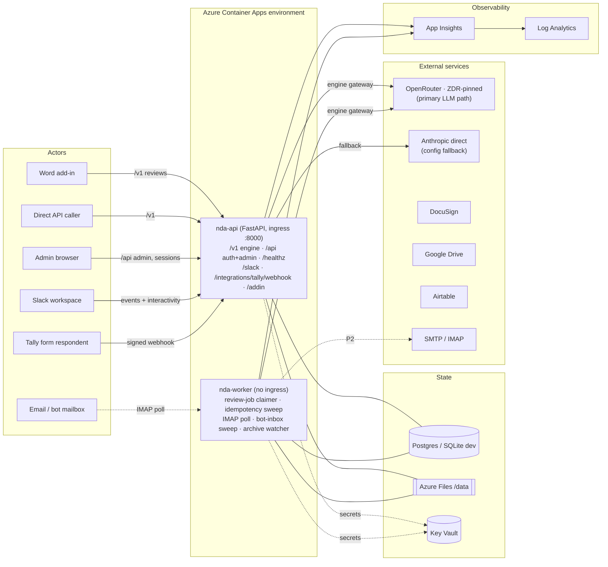
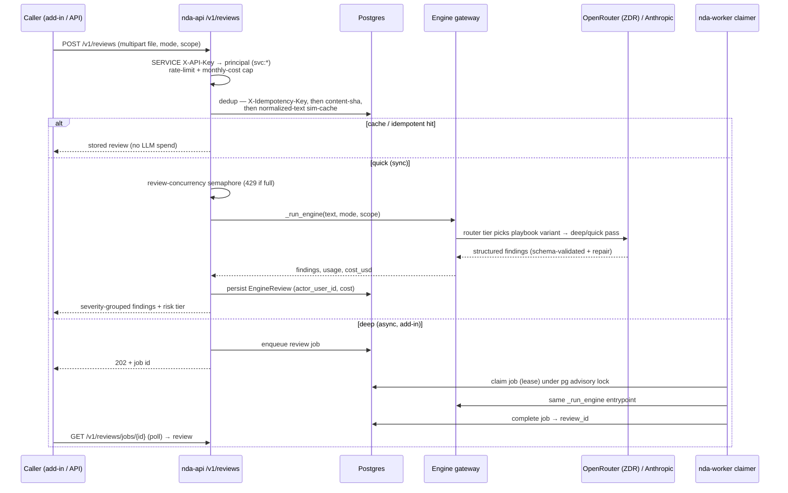

# Architecture

Fast orientation map for the NDA Assistant. The authoritative design is
`docs/PLAN.md`; this file tracks **what now exists in the repo** and grows with
each phase.

Status: **all phases (P0–P6) shipped.** Engine + OpenRouter ZDR gateway + `/v1`
surface, Slack bot with a dashboard-managed approval gate, Tally-webhook NDA
generation (the in-house `/f` form service was retired), DocuSign envelopes,
Drive archive + expiration extraction, the admin console (templates studio,
token registry, `/admin/access`), and the Word add-in. Alembic migrations run
`0001`–`0010`; a dev environment is live on Azure Container Apps. Phase tags on
sections below record when each piece landed — history, not status.

## System context

Two always-on apps off one image (worker overrides the command with
`python -m app.worker`), one Postgres, one Azure Files `/data` share, one Key
Vault via a user-assigned managed identity, one Log Analytics workspace.
Infra detail: `AZURE.md §1`.

## Module map (`backend/app/`, mirrors PLAN §3.2)

Phase column = when the module became substantially real. All modules below
exist and are exercised by the test suite (1300+ tests).

| Module | Responsibility | Phase |
|---|---|---|
| `main.py` | app assembly; capability boot; error envelope; CSRF/CORS/correlation middleware; lifespan seeds (default template, bootstrap admin); routers; `/healthz`; default-deny 404 | P0/P1 ✅ |
| `config.py` | typed `Settings` (env/`.env`); boots with zero config; `is_configured`/`missing_config` for the capability registry | P0/P1 ✅ |
| `capabilities.py` | registry: `telemetry_export`, `llm_inference`, `slack`, `email_in`, `email_out`, `tally`, `docusign`, `google_drive`, `airtable` — enabled / disabled / unhealthy | P0/P1 ✅ |
| `telemetry/` | structlog (console dev, JSON prod), correlation-id middleware, OTel → App Insights (import-guarded) | P0 ✅ |
| `db.py`, `models*.py`, `alembic/` | SQLAlchemy models + migrations `0001_baseline` … `0010_approval_access` (`create_all == alembic head` is test-enforced); `JSON_VARIANT`, hex-UUID PKs | P1–P6 ✅ |
| `engine/` | ported review pipeline: `router` (playbook variant pick), `wholedoc`, `coverage_runner`, `crossclause`, `findings`, `verify`, `spans`, `simcache`, `walkaway`, `portable_schema` | P1 ✅ |
| `ai/` | `gateway` (cache, circuit breaker, retry ladder, `provider_health`), `openrouter` adapter (ZDR fail-closed), `adapters` (direct Anthropic), `factory`/`base` (settings-driven provider plane), `pricing` | P1 ✅ |
| `ingestion/` | docx/pdf/txt parse, OCR (`pytesseract`), redline extraction, segmentation, pdf layout | P1 ✅ |
| `generation/`, `redline/`, `review/` | tokenised docx fill + `strip_unfilled`; redline differ + docx writer; alignment | P1 ✅ |
| `auth/` | WEB sessions (cookie + CSRF) + SERVICE `X-API-Key` principals; entitlement; rate store; bootstrap admin | P1 ✅ (P5 hardening) |
| `api/` | `/v1` engine (`routes_v1`), `/v1/support_task` generation (`routes_support`), `/api` auth/admin/providers/settings/templates | P1 ✅ |
| `worker/` | `scheduler`: review-job claimer + idempotency sweep under a pg advisory lock; `__main__` entrypoint | P1 ✅ |
| `bot/envelope.py` | normalized, frozen `Envelope` — the one intake contract; `verified_sender` gate; `has_content` guard predicate | P2 ✅ |
| `bot/models.py` | `bot_inbox` (fail-closed dedup), `nda_allowlist` (role + label), `nda_pending_requests` (doc-linked), `bot_correlation` | P2–P6 ✅ |
| `bot/channels/` | slack (Bolt), email_in (IMAP + DMARC), email_out (SMTP), replies | P2 ✅ |
| `bot/router.py` | guards → dedup → deterministic route → classifier → allowlist gate (fail-closed) | P2 ✅ |
| `bot/intents/` | template, review, help, generate (Tally link), envelope, template_admin | P2–P5 ✅ |
| `bot/interactivity.py`, `bot/approvals.py`, `bot/correlation.py` | typed button/modal payloads; approval gate (confirm → admin approve → auto-run review → deliver to origin); confirmation state | P2–P6 ✅ |
| `integrations/`, `archive/`, `admin/` | tally webhook mapping; docusign/airtable/convert/storage; archive + watcher; admin pages (incl. `/admin/access`) | P3–P6 ✅ |

Deploy + docs live outside `backend/app/`: `deploy/azure/` (Bicep),
`.github/workflows/` (CI/CD), `docs/`.

## Request flow — `/v1` review, end-to-end (PLAN §3.1)

The engine `/v1` plane is the P1-shipped, machine-authenticated surface the Word
add-in and direct API callers hit. `routes_v1.py`:

`/v1` endpoints in the repo: `POST /v1/reviews` (sync + async by `mode`),
`GET /v1/reviews` (list), `GET /v1/reviews/jobs/{job_id}` (async poll),
`GET /v1/reviews/{review_id}`, `POST /v1/redline`,
`GET /v1/reviews/{review_id}/redline.docx`, and
`POST /v1/support_task/generate-nda` (idempotent tokenised-docx fill). Deep
reviews go async because the ACA ingress ~240s timeout is shorter than a
worst-case review (PLAN §3.1).

## Adapter selection (PLAN §2, §3.8)

`routes_v1._build_gateways` chooses the provider per call, per tier
(deep / quick / router):

- **`OPENROUTER_API_KEY` set** → every tier rides `OpenRouterAdapter`
  (`app/ai/openrouter.py`) against OpenRouter's OpenAI-compatible
  `/chat/completions`, with the vendor-namespaced model ids from config
  (`anthropic/claude-opus-4-8` deep, `…sonnet-4-6` quick, `…haiku-4-5` router).
  **ZDR fail-closed**: under `OPENROUTER_ZDR_ONLY` (default true) every request
  carries `provider {data_collection:"deny", zdr:true, allow_fallbacks:false}`
  plus optional `only:[…]` pinning; no route → an error, never a non-ZDR
  downgrade. The **deep tier pins to `google-vertex`**
  (`OPENROUTER_PROVIDER_ONLY_DEEP`) — opus-4-8's default ZDR route (Bedrock)
  rejects the `json_schema` response format. Structured output is always
  re-validated client-side against the portable schema; recoverable provider
  sloppiness (an omitted field with a recall-safe default, a hallucinated extra
  key) is coerced before validation, then exactly one repair round-trip.
  OpenRouter's reported `usage.cost` is the authoritative `cost_usd`.
- **Only `ANTHROPIC_API_KEY` set** → the direct-Anthropic adapter
  (`app/ai/adapters.py`) is the configuration fallback (native `effort`,
  `cache_control`). The `OPENROUTER_API_KEY` is env-only and deliberately **not**
  a Settings-UI override, so the ZDR-pinned primary can't be swapped from the UI.
- **Neither** → `/v1/reviews` answers `503 no_provider`.

The gateway (`app/ai/gateway.py`) wraps whichever adapter with the response
cache, a per-`(mode, model)` circuit breaker, the retry ladder, and token/cost
accounting shared across reviews.

## Worker jobs (`app/worker/scheduler.py`)

The worker owns the schedule under a **Postgres advisory lock**
(`pg_try_advisory_lock`), so running >1 replica never double-fires; on SQLite it
is always the single runner. Registered on an `AsyncIOScheduler` (UTC):

- **`review_job_claimer`** — every 10s, `max_instances = REVIEW_CONCURRENCY`.
  Claims one async review job (visibility-timeout lease), runs the same
  `_run_engine` entrypoint as the sync route, saves + completes; a failure
  re-queues (attempts-capped dead-letter) and never wedges the other jobs.
- **`idempotency_sweep`** — hourly. Deletes expired flow-step idempotency rows
  (the transient stored `generate-nda` payloads).

Also on the same advisory-lock pattern: the IMAP intake poller, the `bot_inbox`
sweep (`BOT_INBOX_SWEEP_SECONDS`, crash-recovery re-drive of stuck rows), the
`bot_correlation` reaper, and the archive **cache-folder watcher**
(`WATCHER_INTERVAL_MINUTES`).

## Bot-core substrate (PLAN §3.3–§3.5) — shipped in P2

The durable primitives the in-process bot runs on already exist as tables
(migration `0002_bot_core`) and typed models:

- **`bot_inbox`** — the fail-closed dedup + durable intake record. The UNIQUE
  insert on `event_key` **is** the dedup (`slack:<event_id>` / `email:<msg-id>`):
  a duplicate can't insert, so it can't reprocess — closing the old n8n
  fail-open `dedupSeen` hole. `status`/`attempts`/`error` make processing
  crash-recoverable.
- **`nda_allowlist`** — the real allowlist (was an always-allow stub), keyed by
  `(principal_type, principal_key)` on **verified** identity (Slack user id, or
  DMARC-aligned email only).
- **`nda_pending_requests`** — the pending-approval flow; an allowlist miss
  persists here (idempotent `request_key`), notifies the admin, and resumes on
  approval.
- **`bot_correlation`** — short-TTL confirmation/form state keyed by an opaque
  token, replacing the n8n button-`value` JSON; the worker reaps expired rows.

Intake normalizes Slack events and IMAP messages into the single frozen
`Envelope` (`bot/envelope.py`) before the router sees them. `verified_sender`
(Slack v0 HMAC verified / email DMARC-aligned) is the security gate every
allowlist and action-triggering intent checks — unverified senders stay
read-only-helpful (PLAN §6).

## Tally intake (PLAN §3.6) — P3, reworked

The NDA intake form lives on **Tally** (form "NDA Generator"); the in-house `/f`
form service that previously filled this role was **retired** (migration
`0009_tally_dropforms`). The flow:

1. The bot's **generate intent** hands out a channel-prefilled Tally link. The
   link carries a signed **routing token** (HMAC, `mint_routing_token`) naming
   the origin conversation, so a submission can only be delivered back to the
   channel/thread that requested it (anti-redirection).
2. On submit, Tally POSTs a **signed webhook** to `/integrations/tally/webhook`
   (`app/api/routes_tally.py`). The HMAC signature is verified fail-closed
   against `TALLY_SIGNING_SECRET` (the `tally` capability gate; absent → 503
   stub, boot-safe).
3. `app/integrations/tally.py` maps the submission (all branch fields arrive,
   unanswered ones null — the mapper only takes non-empty values), generates the
   NDA through the same tokenised-fill path as `/v1/support_task`, and delivers
   the document to the origin conversation via the reply service.

## DocuSign envelope flow (PLAN §3.9) — P3

`app/integrations/docusign.py` (JWT-grant; we fill the docx, DocuSign only signs)
behind the `docusign` capability. Three interactive entry points converge on one
confirm card (`bot/intents/envelope.py` + `bot/interactivity.py`): ≥2 signers +
attached doc → unfilled-`{{token}}` guard → **explicit human confirm before send**
(the deliberate change vs. the old immediate send, closing the spoofed-email hole);
<2 signers → a details modal collector; no file → thread-doc recovery
(`bot/thread_docs.py`). State lives in `bot_correlation`; button values carry only
`{v, kind, ref}`. Every send persists an `nda_envelopes` attempt row with the
requester mapping (the P4 watcher DMs from it) and the ported `sha1(doc|recipients)`
idempotency key; failed sends persist too.

## Archive, watcher, expiration (PLAN §3.10) — P4

`app/archive/` files signed NDAs both channels → PDF-normalize (`soffice`) →
storage provider (`app/integrations/storage/`, Google Drive now, SharePoint stub).
The worker's **cache-folder watcher** (`app/archive/watcher.py`, schedule
`WATCHER_INTERVAL_MINUTES`, default 5 — replacing the old n8n 1-min cadence) polls
the Drive cache folder, applies the ported skip filters ("certificate of
completion", `summary.pdf`), does a destination duplicate check, LLM-classifies
issuer/recipient/mutuality, renames `<yyyyMMdd>_<issuer>_<mNDA|uNDA>_<recipient>.pdf`,
and records a status on `nda_cache_processed`
(`processing → renamed | saved_default_name | duplicate_skipped | failed`).
Expiration extraction (PLAN §3.8 `expiration` alias) upserts **minimal fields** to
Airtable (`app/integrations/airtable.py`), capability-gated.

## Token registry, template studio, form builder, admin UI (PLAN §3.7) — P5

The template/token/form triangle is managed as one system:

- **Token registry** (`app/registry/`): tokens are first-class rows
  (`registry/tokens.py` CRUD with validated snake_case names + a delete that first
  builds a full usage report); `registry/drift.py` emits `token_created` /
  `token_deleted` / `template_published` **drift events** that flag every affected
  NDA form `needs_update`, notify the owner over the reply service, and prepare a
  one-click `build_sync_plan` / `apply_sync_plan` diff (add-field / unbind / remove
  under optimistic concurrency). `registry/guard.py` blocks a generation-bound send
  while a required binding is missing.
- **Template studio** (`app/studio/`): the highlight→click tokenizer over a stable,
  addressable read-only document view (`docview.py`), run-aware span→`{{token}}`
  surgery that is the exact inverse of the filler (`tokenize_ops.py`), a
  server-side per-draft operations log with arbitrarily deep undo/redo (`oplog.py`),
  the find-and-map assistant (`findmap.py`), and the live checklist (`checklist.py`).
  Wire contract: locators are `part + tbl:t:r:c + p:i`; a view carries a
  `content_hash` and a stale edit raises `studio_stale_view` (409) →
  re-extract + retry; the `studio_*` errors are `EngineError` subclasses that
  propagate into the standard envelope.
- **Slack guided template-replacement flow** (`app/bot/intents/template_admin.py`,
  PLAN §3.7 simple path): an **interactivity-driven chain from the template picker**.
  `AdminTemplateIntent` wraps the ported `TemplateIntent` and appends an *Update this
  template* button to the picker card **for admin senders only**; the chain is
  upload-to-thread → validate (studio checklist vs the registry's required set for
  that template) → optional sample test-drive → **Confirm & publish** (the same
  blob + `template_version` + `emit_template_published` drift path the studio
  publishes through) → version + rollback info. Every click is fail-closed
  admin-authorized (admin channel or an injected `is_admin`); a non-admin gets no
  button and any forged `tpl_admin_*` click is refused.
- **Admin UI + auth** (`app/admin/`, `app/api/routes_admin*.py`): server-rendered
  Jinja pages behind the hardened session plane (rate-limited login, reset email,
  optional `/admin` IP allowlist, `require_admin`), strict CSP (no inline
  script/style — `addEventListener` + CSS classes). `GET /api/admin/capabilities`
  (`require_admin`) returns `registry.report()` + app version/env — the detailed,
  admin-gated counterpart of the shallow public `/healthz` (PLAN §2 decision 4), so
  the admin home renders one status card per integration without leaking config
  state anonymously.
- **Access console** (`/admin/access`, P6): the bot approval gate is managed here,
  not by env vars — allowlist CRUD (role `admin`/`member` + label), pending
  approval requests, and the admin Slack-channel/email routing (a `settings_store`
  override with the env value as fallback). Users gain a `slack_user_id` binding
  so web roles and Slack identities resolve to one principal; approving a request
  auto-adds the requester as a member and auto-runs the stashed review.

## Design invariants (carried from PLAN)

- **Gates fail closed** (signatures, allowlist, dedup, ZDR routing);
  **capabilities fail soft** (missing config ⇒ feature off, boot never crashes).
  The distinction is explicit: `capabilities.py` only answers "is this channel
  wired?"; the fail-closed gates live in the bot's transactional code.
- **Migrations run pre-deploy, never at boot** (`app/db_migrate.py`;
  expand/contract, compatible one release back). The lifespan runs only
  idempotent `create_all` + seed hooks, never `ALTER`.
- **Replicas = 1** until the scale-path blockers clear (`AZURE.md §7`).
- **Metadata-only telemetry** by default (no prompt/completion bodies); ZDR
  pinned end-to-end, fail-closed.
